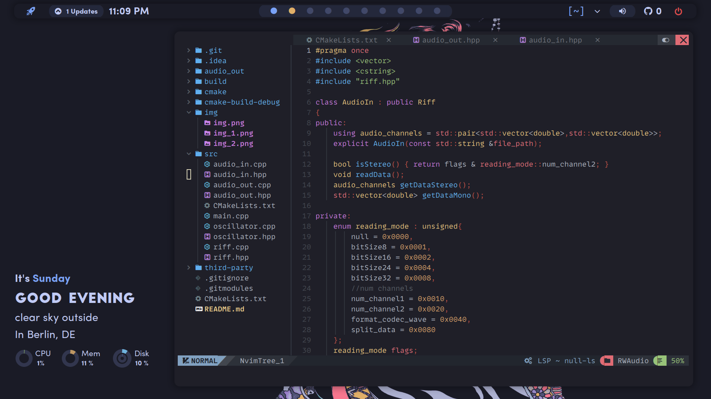
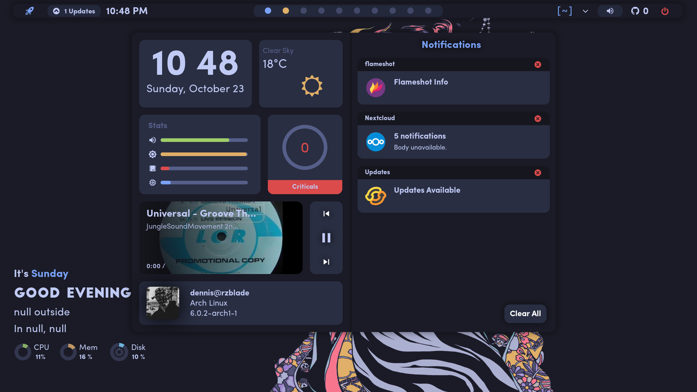
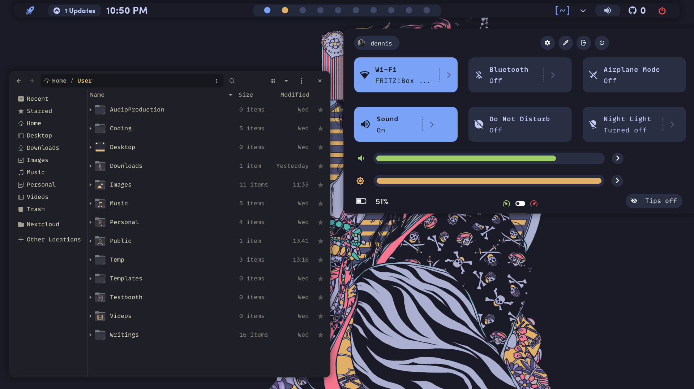

# Dotfiles

I use these for all my [Arch linux](https://archlinux.org/about)
Desktop Environments. I'm trying to provide good portability and productivity.
Please have a look into the specific dotfiles when using as these are
quite specific to my needs and should be to yours aswell.





## Prerequisite

>> Have a look into my [arch-install](https://github.com/deeedob/arch-install)
>> if installing on a new system.

```bash
$ git clone https://github.com/deeedob/ddob-dotfiles.git ~/.dotfiles
```

```bash
cd .dotfiles
./install
```

This will setup and populate the System with my dotfiles.

## Customization

- user login image
  - files/root/username.jpg
- specify github and weather api
  - /home/\<user\>/User/Personal/Private/.glob_env
    - export GH_TOKEN=\"token\"
    - export GH_USER=\"username\"
    - export WEATHER_KEY=\"api_key\"
    - export WEATHER_ID=\"api_location\"
- set themes with `lxappearance`
